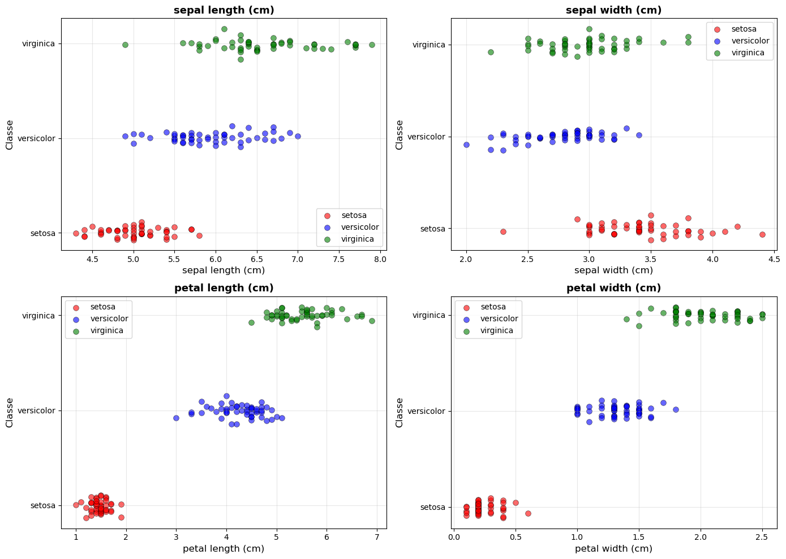
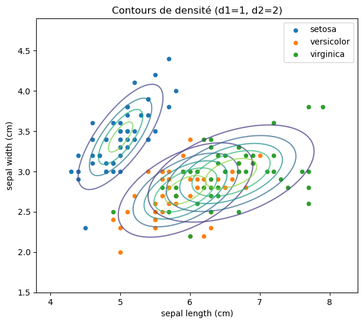

# 🌸 Analyse Statistique Descriptive : Jeu de données Iris

Ce projet présente une analyse statistique approfondie du célèbre jeu de données **Iris** de Fisher. L'objectif est d'explorer les caractéristiques morphologiques de trois espèces d'iris (**Setosa**, **Versicolor**, **Virginica**) à travers des analyses monodimensionnelles, conditionnelles et bidimensionnelles, afin d'évaluer leur pouvoir discriminant pour la classification.

---

## 🎯 Objectif

L'étude vise à caractériser les espèces d'iris en utilisant des outils statistiques descriptifs pour :

*   Calculer les statistiques globales (moyenne, variance) des descripteurs.
*   Analyser la distribution des données par classe (statistiques conditionnelles).
*   Appliquer le **théorème de la variance totale (Konig-Huygens)** pour distinguer les variances intra-classe et inter-classe.
*   Identifier les meilleurs descripteurs pour la classification automatique.
*   Modéliser les distributions à l'aide de **Modèles de Mélange Gaussien (GMM)**.

---

## 📊 Données

*   **Source** : Jeu de données Iris de `scikit-learn`.
*   **Échantillon** : 150 observations (50 par classe).
*   **Descripteurs** : 4 Variables
    *   $d_1$ : Longueur du sépale (cm)
    *   $d_2$ : Largeur du sépale (cm)
    *   $d_3$ : Longueur du pétale (cm)
    *   $d_4$ : Largeur du pétale (cm)
*   **Classes** : 3 espèces 
    *   Setosa
    *   Versicolor
    *   Virginica

---

## 🛠️ Outils utilisés

*   **Python 3**
*   **Bibliothèques** : Pandas, NumPy, Matplotlib, Scikit-learn (GMM, KNN)
*   **Environnement** : Jupyter Notebook

---

## 📂 Structure du projet

```text
TP1-Analyse-Statistique-Iris/
│
├── README.md                # Ce fichier
├── TP1_TCHATCHOUA.pdf       # Rapport complet d'analyse
├── TP1_TCHATCHOUA.ipynb     # Notebook avec tous les calculs et graphiques
└── images/                  # Visualisations générées
```

---

## 🔬 Méthodologie d'Analyse

L'analyse est structurée en quatre étapes clés :

1.  **Analyse Monodimensionnelle** : Calcul des moyennes et variances globales pour chaque caractéristique.
2.  **Analyse Conditionnelle** : Étude des statistiques par espèce et calcul du ratio de variance inter-classe ($Var_{inter} / Var_{totale}$).
3.  **Analyse Bidimensionnelle & GMM** : Visualisation des corrélations entre paires de descripteurs et estimation des densités de probabilité par GMM.
4.  **Validation** : Vérification de l'intuition statistique par un classifieur des **K-plus proches voisins (KNN)**.

---

## 💡 Résultats Clés

### 1. Pouvoir Discriminant
*   **Petal Length ($d_3$)** est le meilleur descripteur avec un ratio de variance inter-classe de **94%**, offrant une séparation quasi-parfaite des classes.
*   **Sepal Width ($d_2$)** est le moins performant (**38%**), présentant un fort chevauchement entre Versicolor et Virginica.

### 2. Séparabilité des Classes
*   L'espèce **Setosa** est systématiquement isolée et facilement identifiable sur tous les descripteurs.
*   **Versicolor** et **Virginica** présentent des distributions plus proches, nécessitant une analyse bidimensionnelle pour une meilleure distinction.

#### 3. Performance du Classifieur
* Le modèle KNN confirme ces résultats avec une précision élevée, validant l'approche statistique descriptive préalable.

---

## 📊 Visualisations


*Figure 1 : Distribution des classes selon les descripteurs.*
Ce graphique montre la répartition des trois espèces d'iris pour chaque caractéristique. On observe une séparation nette de l'espèce Setosa, tandis que Versicolor et Virginica présentent des chevauchements, notamment sur la largeur des sépales.


*Figure 2 : Modélisation des densités par GMM (Sepal Length vs Sepal Width).*.
Cette visualisation illustre l'estimation des densités de probabilité par des modèles de mélange gaussien. Les ellipses représentent les contours de densité pour chaque classe, confirmant la structure statistique et la dispersion des données dans le plan bidimensionnel.

---

## 💻 Code Source et Fichiers

*   **Notebook** : Le code complet pour le traitement des données, les calculs de variance et la génération des graphiques est disponible dans [codeSource.ipynb](TP1_TCHATCHOUA.ipynb).
*   **Rapport** : Pour une interprétation détaillée des courbes de densité et des matrices de covariance, consultez le [Rapport PDF](TP1_TCHATCHOUA.pdf).

---

## 👤 Auteur

**Michel TCHATCHOUA** - Étudiant en Ingénierie des Données (IADS 3)
